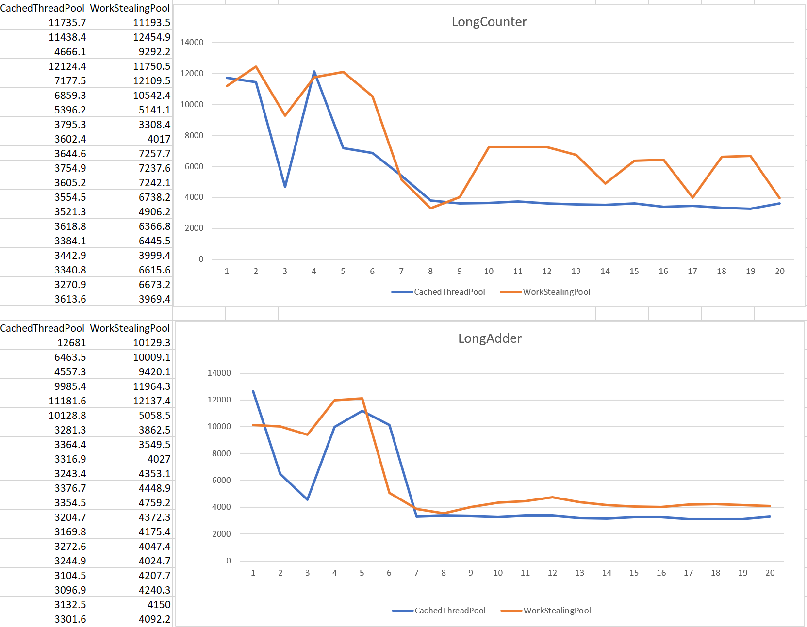

#5.1.3

#5.1.4.

We noticed that at the beginning the execution is slower due to "warm up" but later
it became more constant and faster. Work stealing pool has more variations than Cached
thread pool in its execution.The best performance would be to use 1 thread per core. In
my case, that would be 4-5 threads since I have 4 cores. The surprise is when you get 
better execution with 1 or >10 threads.

#5.3.3.

##1

0.1154723
0.0354231
0.0671518
0.0258844
0.0674077
0.057447601
0.052797601
0.0290756
0.1179374
0.012909799
0.047322599
0.0257894
0.058638299
0.152191001
0.0655246
0.0883668
0.0295799
0.0597348
0.0490479
0.084810901
0.0288524
0.081156499
1.4563799

##2

0.1305047
0.094503401
0.146958201
0.0606128
0.2850228
0.133233001
0.102869
0.1362065
0.385602599
0.1502869
0.2172367
0.221443501
0.2096423
0.5575017
0.0990405
0.051180601
0.086797701
0.2497534
0.618680999
0.2308716
0.1989226
0.2925122
2.1662716

##3

0.0958272
0.051962299
0.064056
0.041131901
0.049769801
0.0978774
0.090076601
0.090995699
0.166009999
0.0437139
0.042298999
0.067626899
0.0448256
0.1678173
0.112041101
0.0513974
0.0287556
0.0533293
0.032987999
0.0848038
0.0432799
0.205748601
1.5785286

##4

0.1366649
0.0683572
0.106009
0.0368728
0.148166801
0.2251281
0.2359041
0.295719499
0.1291388
0.0208447
0.0474984
0.013104699
0.0700077
0.154841
0.082149301
0.094018201
0.059755
0.0727888
0.0994647
0.196762399
0.0172603
0.1429335
2.2383954

##5

0.4185278
0.0556481
0.135282201
0.159713901
0.0612059
0.181361001
0.058248
0.0299457
0.1004154
0.027904599
0.1271081
0.043695
0.052830601
0.2522292
0.0739019
0.0621944
0.1058881
0.1546543
0.1242716
0.1177488
0.0840085
0.137607201
1.5532256

#5.3.4.

##1
0.0671578
0.0696681
0.0696973
0.069673899
0.070075499
0.074291601
0.084037101
0.0189737
0.020631299
0.0972229
0.0304787
0.0380335
0.0558115
0.041255699
0.039480699
0.0118542
0.0535314
0.057801299
0.104095901
0.0991522
0.0480074
0.104362101
1.931321001

##2
0.063197
0.0641543
0.0640756
0.069827099
0.0698281
0.0755274
0.0910432
0.042325799
0.116780101
0.054356201
0.0557866
0.1437487
0.1336393
0.1863668
0.1808636
0.1319737
0.1735471
0.142821399
0.0720235
0.2585648
0.0838225
0.112101501
1.511919501

##3
0.0560756
0.0562702
0.0562691
0.0561467
0.0559687
0.0562097
0.0867673
0.0897288
0.056406901
0.0587394
0.058885501
0.086003401
0.216964799
0.184501
0.1874065
0.2455357
0.3020817
0.243418201
0.217752799
0.244803599
0.1384246
0.176794799
1.4733071

##4
0.1953263
0.195305401
0.1971457
0.197318901
0.205260501
0.2050311
0.2141343
0.2270369
0.0467599
0.045772901
0.07318
0.0813702
0.061768701
0.0589533
0.087982599
0.1119048
0.0219643
0.072075199
0.081694901
0.148478899
0.2218973
0.194034701
2.0169352

##5
0.061152899
0.0616514
0.0686249
0.0696525
0.0835518
0.100360401
0.0416012
0.0410702
0.1126518
0.0171207
0.016002199
0.0653588
0.139567299
0.0563961
0.072504299
0.0459678
0.1372886
0.068945
0.0832635
0.0924582
0.0978488
0.1553554
1.4859473

Fetching 23 webpages in parralel is not 23 times faster than fetching them one by
one because those processes mostly depend on internet connection and web server's
responses. It is faster but not 23 times faster.

#5.4.3.

Yes

#5.4.5. 

The runnables all depend on each other. 
Setting the size of the thread pool to 3 means that no more than 3 of the runnables can be executed at any one time.
In our case, that means that the execution blocks, as the 3 first runnables are waiting for other runnables that currently have no available threads.

#5.4.6. 

Yes, we get the same result as before, but in a different order. 
This happens because the urls are being consumed faster and in a more unpredictable order by the 2 PageGetters.

