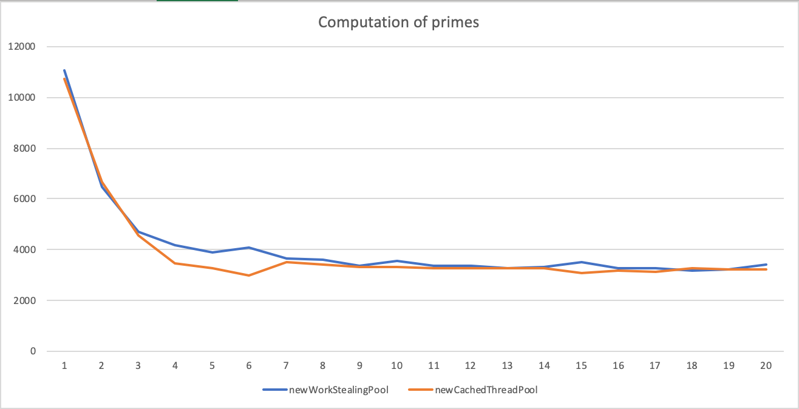
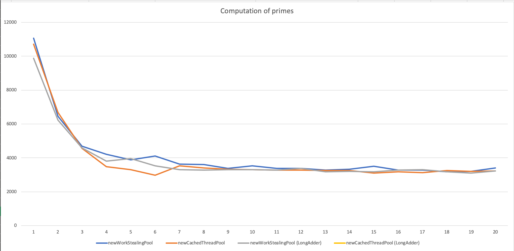

# Exercises week 5

## Exercise 5.1

### 1. CachedThreadPool

```
# OS:   Mac OS X; 10.14.5; x86_64
# JVM:  Oracle Corporation; 12.0.2
# CPU:  null; 8 "cores"
# Date: 2019-09-30T09:26:04+0200
countSequential                    9956,7 us     163,91         32
9592.0
countParTask1     32               2887,4 us     312,82        128
9592.0
countParTask2     32               2819,7 us     131,38        128
9592.0
countParTask3     32               3014,0 us     153,38        128
9592.0
```

### 2. WorkStealingPool

```bash
# OS:   Mac OS X; 10.14.5; x86_64
# JVM:  Oracle Corporation; 12.0.2
# CPU:  null; 8 "cores"
# Date: 2019-09-30T09:28:56+0200
countSequential                   10134,9 us     221,09         32
9592.0
countParTask1     32               3025,6 us     256,80        128
9592.0
countParTask2     32               2793,8 us     127,94        128
9592.0
countParTask3     32               3137,8 us     126,89        128
9592.0
```

### 3. Plotting of graph



### 4. Reflection

Reflect

### 5. LongAdder



## Exercise 5.3

### 1. TestDownload

Works as expected

### 2. Download from multiple URLs

```bash
URL: https://www.google.com, Content-Length: 12684
URL: https://www.heise.de, Content-Length: 11012
URL: https://www.wsj.com, Content-Length: 945830
URL: https://www.welt.de, Content-Length: 981591
URL: https://www.dn.se, Content-Length: 180352
URL: https://www.cia.gov, Content-Length: 9067
URL: https://www.amazon.com, Content-Length: 25943
URL: https://www.vg.no, Content-Length: 12081
URL: https://www.dsb.dk, Content-Length: 13824
URL: https://www.bbc.co.uk, Content-Length: 13017
URL: https://www.microsoft.com, Content-Length: 69734
URL: https://www.eb.dk, Content-Length: 6495
URL: https://www.miele.de, Content-Length: 11190
URL: https://www.tv2.dk, Content-Length: 222
URL: https://www.dtu.dk, Content-Length: 8171
URL: https://www.bmw.com, Content-Length: 269199
URL: https://www.itu.dk, Content-Length: 137765
URL: https://www.nytimes.com, Content-Length: 1130001
URL: https://www.theguardian.com, Content-Length: 425540
URL: https://www.lemonde.fr, Content-Length: 271739
URL: https://www.di.ku.dk, Content-Length: 9109
URL: https://www.dr.dk, Content-Length: 105349
URL: https://www.ing.dk, Content-Length: 98467
```

### 3. Runtime

1. 8.728691322
1. 7.986051802
1. 9.566269307
1. 8.561474962
1. 7.213339154
